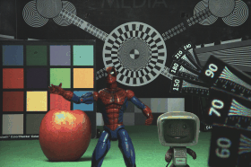

===========
Plenopticam
===========

A light field photography application (macOS_ or Win_) for computational change of perspective view and synthetic focus based on a Standard Plenoptic Camera (SPC).

Check out Plenopticam's partner project Plenoptisign_ capable of estimating metric light field geometries.

|license| |code| |repo| |downloads|

Installation
------------

    1. install Python from https://www.python.org/
    2. download the source_ using ``$ git clone https://github.com/hahnec/plenopticam.git``
    3. go to the root directory ``$ cd plenopticam``
    4. install with ``$ python setup.py install`` from the root directory

Usage
-----

If installation ran smoothly, enter the following

    ``$ plenopticam -g``

to the command line after which a tidy user interface will pop up (see below).

|gui|

.. |gui| raw:: html

    

.. note::
    "Pick folder" checkbox is useful to point to a directory containing calibration archive files of Lytro Illum cameras.
    In such case, the white image calibration file corresponding to the Illum image is found automatically.

Results
-------

|OPEX|_
=============================

|spiderman|

* custom plenoptic camera built at the Univ. of Bedfordshire

.. |OPEX| replace:: Optics Express dataset
.. _OPEX: https://ndownloader.figshare.com/files/5201452

|Irisa|_
========================

|fruits|

.. |fruits| raw:: html

    

.. * |Stanford|_

.. |Irisa| replace:: Irisa dataset
.. _Irisa: https://www.irisa.fr/temics/demos/IllumDatasetLF/index.html

.. |Stanford| replace:: Stanford dataset
.. _Stanford: http://lightfields.stanford.edu/mvlf/

Further information
-------------------

* visit `plenoptic.info <http://www.plenoptic.info>`__ for technical details, animated figures and theoretical background

Credits
=======

Contributors
------------

|Hahne|

`Christopher Hahne <http://www.christopherhahne.de/>`__

Sponsors
--------

|EUFramework|

`under Grant EU-FP7 ICT-2010-248420 <https://cordis.europa.eu/project/rcn/94148_en.html>`__

|UoB|

`Institute for Research in Applicable Computing (IRAC) <https://www.beds.ac.uk/research-ref/irac/about>`__

Citation
--------
If you find this work helpful, please cite the following publications:

* `Refocusing distance of a standard plenoptic camera <https://doi.org/10.1364/OE.24.021521>`__, *OpticsExpress*, `[BibTeX] <http://www.plenoptic.info/bibtex/HAHNE-OPEX.2016.bib>`__

* `Baseline and triangulation geometry in a standard plenoptic camera <https://www.plenoptic.info/IJCV_Hahne17_final.pdf>`__, *Int. J. of Comp. Vis.*, `[BibTeX] <http://plenoptic.info/bibtex/HAHNE-IJCV.2017.bib>`__

.. Image substitutions

.. |release| image:: https://img.shields.io/github/release/hahnec/plenopticam.svg?style=flat-square
    :target: https://github.com/hahnec/plenopticam/archive/master.zip
    :alt: release

.. |license| image:: https://img.shields.io/badge/License-GPL%20v3.0-orange.svg?style=flat-square
    :target: https://www.gnu.org/licenses/gpl-3.0.en.html
    :alt: License

.. |code| image:: https://img.shields.io/github/languages/code-size/hahnec/plenopticam.svg?style=flat-square
    :target: https://github.com/hahnec/plenopticam/archive/master.zip
    :alt: Code size

.. |repo| image:: https://img.shields.io/github/repo-size/hahnec/plenopticam.svg?style=flat-square
    :target: https://github.com/hahnec/plenopticam/archive/master.zip
    :alt: Repo size

.. |downloads| image:: https://img.shields.io/github/downloads/hahnec/plenopticam/total.svg?style=flat-square
    :target: https://github.com/hahnec/plenopticam/archive/master.zip
    :alt: Downloads

.. |UoB| raw:: html

    

.. |EUFramework| raw:: html

    

.. |Hahne| raw:: html

    

.. Hyperlink aliases

.. _source: https://github.com/hahnec/plenopticam/archive/master.zip
.. _macOS: https://github.com/hahnec/plenopticam/releases/download/v1.0.0-alpha/plenopticam_1.0.0-alpha_macOS.zip
.. _Win: https://github.com/hahnec/plenopticam/releases/download/v1.0.0-alpha/plenopticam_1.0.0_alpha_win.zip
.. _Plenoptisign: https://github.com/hahnec/plenoptisign/